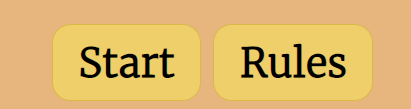
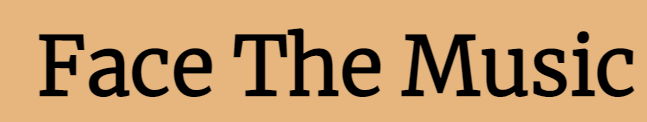
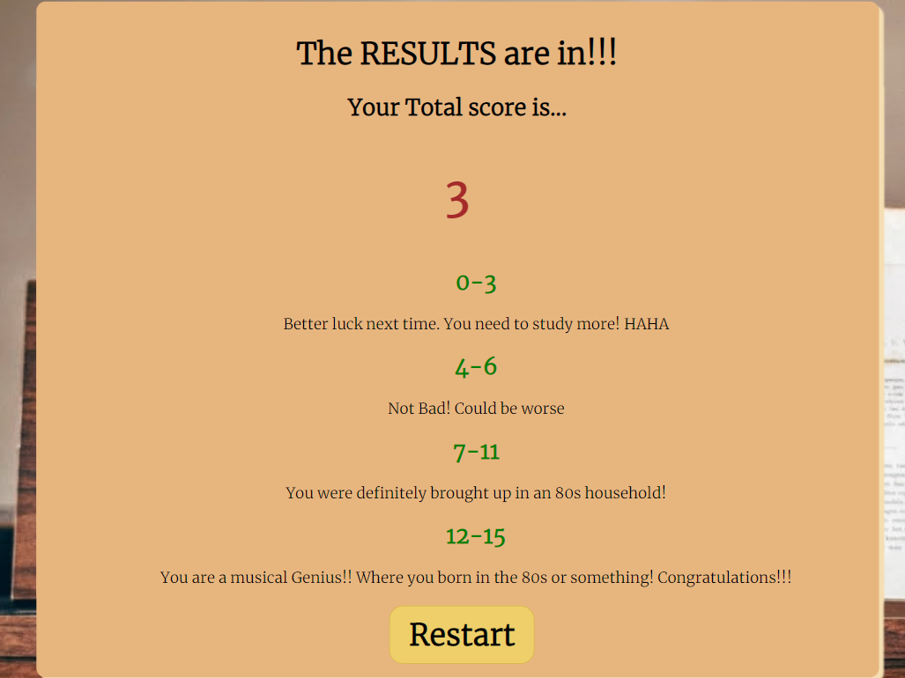
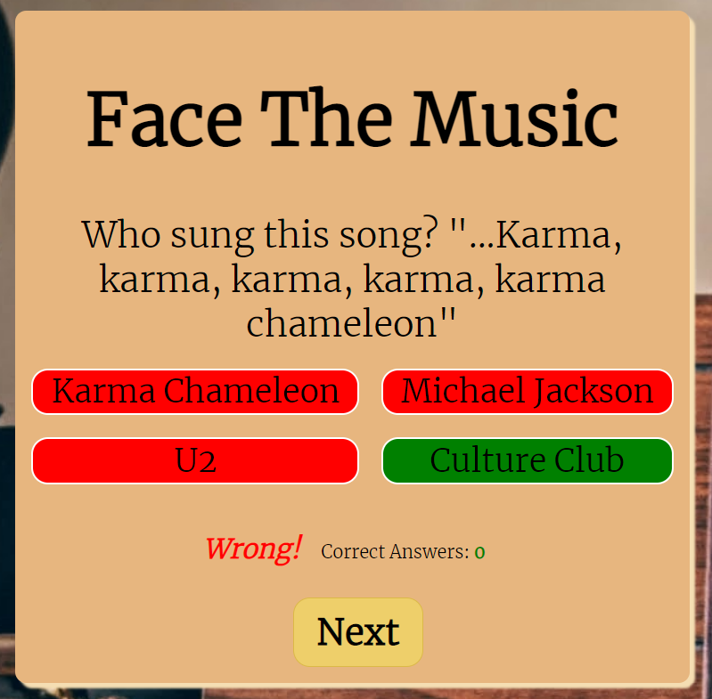
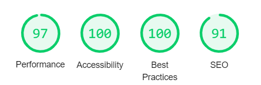
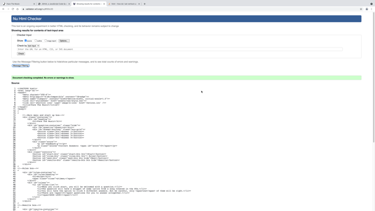
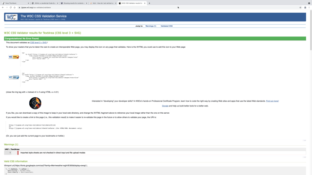
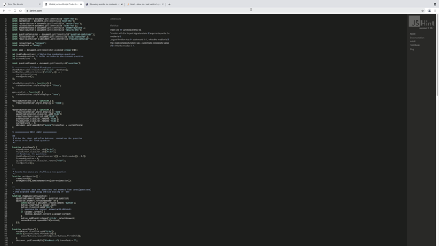

# Face The Music
[Live link](https://sharpryan20.github.io/ci-project-2/)

[GitHub Repository](https://github.com/Sharpryan20/ci-project-2)

# Overview

[Face The music](https://sharpryan20.github.io/ci-project-2/) is my Portfolio 2 project. I was originally given some examples that I could use when first designing my project and one of the examples was to design a quiz. I decided to use that example and ended up creating 'Face the music.

It is a quiz that challenges and entertains music lovers as they struggle to think of the song from a snippet of lyrics.

The site is fully responsive on all devices and the site is generated through HTML. 

# UX

## Project Goals: 

* Create a user-frinedly and accessible website.
* Create an entertaing music quiz that is straight forward to play, start and restart.
* Ensure that the questions were randomized in order and never in the same pattern.
* Provide User with feedback at the end of the game to let them know how well they did throughout the quiz.

## First Time Visitor Goals:

* As a first time visitor I need to able to navigate the quiz and clearly understand how to play the quiz if I was struggling.
* I want to be able to see throughtout the quiz if I am gettin my answers correct and to be able to check my total score.
* As a user, I want to be able to access the website on desktop, tablet and mobile devices to ensure convenience.

## Returning visitor goals:

* As a returning visitor I would like to be able to keep track of my progress and be able to check my high scores in future.
* I want to be able to play different quzzies of all types.

## Target Audience:

My target auidence is anyone who:

* Has a passion for Muisc.
* Likes to face a challenge.

# Skeleton

## Wireframes

All initial mockups of my site were created and desinged using Balsamiq. Images of my mockups will be below.

### Start up page

### Rules Box

### Quiz Box 

### Phone 

# Surface 

## Imagery 

I only used one Image throughout the whole site but it stays in place the entire time. The image really higlights the entire purpose and interest of the quiz. 

## Design

### Color Scheme: 

The site's primary colors are cream, yellow and brown. The above image shows the exact shades that I used to build up my website.

I chose this color palette because it connects to the theme of music, like an old rustic piano or an old music sheet. I decided to use black for the text as it works well against the light backgrounds.

## Layout/Structure:

* The quiz itself and all the pop up boxes were generated through JavaScript.

* The sites layout is very simplistic to the viewers eyes when they first enter the site. The singular image adds depth and immediately draws the users attention to the start up menu. 

* The users are initally greeted with the title 'Face the Music' and two buttons; 'Start' and 'Rules'.

* If the user clicks on the rules button it will load up and box and it will explain to the user how to play the game.

* When the user clicks the start button the user will be presented with a question that is randomly generated from 15 questions and will be required to pick an answer out of 4 choices.

* When the user cycles through all the questions they will recieve another pop up box, just like the rules box but this time it will bring up their results and place them in a category.

* In future I would like to create more categories and different types of quizzes to keep the user entertained and coming back.

# Features 

## Existing features 

* All content appears within containers. the containers all have max-width to make sure they fit no matter the screen size.

* The buttons on the home page will help users navigate through the quiz. 

### Header 

* The logo 'Face The Music' is large which immediately fraws the users attention away from the background image to the container which contains the entire quiz itself.

### Results Box 

* Throughout the quiz the users score is counted and then displayed at the end on the results box. The user can then see how well they have done from the list below.

### Answer

* When a question is answered correctly, the score in the middle wil increment by 1.

* When the user clicks an answer the colors of all the choices will change color depending on if choice is correct or not.

* As well as the color changes to all the options, either a 'Correct!' or 'Wrong!' text will appear next to the score count. 

## Future Features

* Rather than clicking the start button and it loads straight into the quiz, it loads into a another section which you can find mulitple different quzzies. 

* Add additional quzzies including different genres, specific artists, specific time periods.
 
* Add the ability to write your username and a highscore section so users can track not only their scores but other users.

# Technologies used

## Languages Used

* [HTML:](https://www.w3.org/html/)  - HTMl5 provided the content and the structure of my website.

* [CSS:](https://www.w3.org/Style/CSS/) - CSS was used to style all my pages.

* [JS:](https://en.wikipedia.org/wiki/JavaScript) - Programming language used for the function and interactivity behind the quiz.

## Frameworks, Libraries and Programs used:

* [Google Fonts:](https://fonts.google.com/) - Google fonts was used to import my font for my Title.

* [Git](https://git-scm.com/) - Git was used for version control. Allowing me to create backups whenever significant changes were made to code by utilizing the gitpod terminal to commit to Git and Push to GitHub.

* [GitHub:](https://github.com/) - GitHub was used to externally hold my repository. Will also use GitHub pages to deploy my website.

* [Balsamiq:](https://balsamiq.com/) - Balsamiq was used tp create wireframes during the designing process.

* [Coolors](https://coolors.co/) - Coolors was used to help design my colour palette for the website.

* [Favicon](https://favicon.io/) - Favicon used to implement a favicon on the browser tab.

* [Pexels](https://www.pexels.com/search/music/) - Pexels used to find my background image.

# Testing

## Manual testing

Testing was conducted frequently throughout the development of the site. I had a constant Live preview of the site side-by-side to my code so I was aware of any immediate changes to my code and was able to change and alter my code in dev tools before implementing it into my actual code on GitPod.

I tested the responsiveness on through console tools and on different browsers, with Google Chrome being my default browser.

I got friends of mine to test my site on their devices so I was able to gather a range of different data.

Lighthouse reports were also conducted frequently to ensure the site was preforming well. I have an image of the final lighthouse report that I completed on my site.

## Automatic testing

All three languages that were used in the project where ran through validators to ensure there were no problems or errors with my code.

### HTML validator

### CSS validator

### JS validator

## Bugs

When first trying to implement the increment score function, I came across a few times that it would increase the score no matter if the question was answered correctly. Sometimes it would also increase it but by mire than 1 point. I realised that I was calling the 'IncrementScore' function in the wrong function.

# Deployment 

## GitHub Pages 

I deployed this site through GitHub pages. This was a simple process, as follows:

-   Log into GitHub
    
-   Go to the repository

-   Go to settings
    
-   Scroll down to "GitHub Pages" section
    
-   Select the source (I chose master branch in this instance)
    
-   After some time, the site will be deployed and ready to see.

# Credits

* Thanks to my mentor Reuben Ferrante,for all his support throughout the project. 

* Youtube channel 'Web Dev Simplified', specifically this [video](httSps://www.youtube.com/watch?v=riDzcEQbX6k), which helped me kickstart my project. I used snippets of code from this video in my own project.

# Thanks

