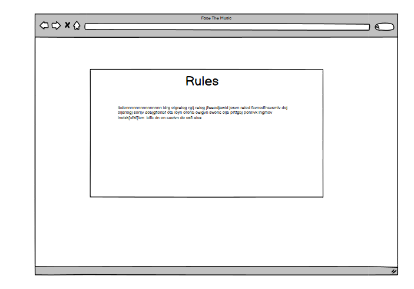

# Face The Music
[Live link](https://sharpryan20.github.io/ci-project-2/)

[GitHub Repository](https://github.com/Sharpryan20/ci-project-2)

# Overview

[Face The music](https://sharpryan20.github.io/ci-project-2/) is my Portfolio 2 project. I was originally given some examples that I could use when first designing my project and one of the examples was to design a quiz. I decided to use that example and ended up creating 'Face the music.

It is a quiz that challenges and entertains music lovers as they struggle to think of the song from a snippet of lyrics.

The site is fully responsive on all devices and the site is generated through HTML. 

# UX

## Project Goals: 

* Create a user-frinedly and accessible website.
* Create an entertaing music quiz that is straight forward to play, start and restart.
* Ensure that the questions were randomized in order and never in the same pattern.
* Provide User with feedback at the end of the game to let them know how well they did throughout the quiz.

## First Time Visitor Goals:

* As a first time visitor I need to able to navigate the quiz and clearly understand how to play the quiz if I was struggling.
* I want to be able to see throughtout the quiz if I am gettin my answers correct and to be able to check my total score.
* As a user, I want to be able to access the website on desktop, tablet and mobile devices to ensure convenience.

## Returning visitor goals:

* As a returning visitor I would like to be able to keep track of my progress and be able to check my high scores in future.
* I want to be able to play different quzzies of all types.

## Target Audience:

My target auidence is anyone who:

* Has a passion for Muisc.
* Likes to face a challenge.

# Skeleton

## Wireframes

All initial mockups of my site were created and desinged using Balsamiq. Images of my mockups will be below.

### Start up page

### Rules Box

### Quiz Box 

### Phone 

# Surface 

## Imagery 

I only used one Image throughout the whole site but it stays in place the entire time. The image really higlights the entire purpose and interest of the quiz. 

## Design

### Color Scheme: 

The site's primary colors are cream, yellow and brown. The above image shows the exact shades that I used to build up my website.

I chose this color palette because it connects to the theme of music, like an old rustic piano or an old music sheet. I decided to use black for the text as it works well against the light backgrounds.

## Layout/Structure:

* The quiz itself and all the pop up boxes were generated through JavaScript.

* The sites layout is very simplistic to the viewers eyes when they first enter the site. The singular image adds depth and immediately draws the users attention to the start up menu. 

* The users are initally greeted with the title 'Face the Music' and two buttons; 'Start' and 'Rules'.

* If the user clicks on the rules button it will load up and box and it will explain to the user how to play the game.

* When the user clicks the start button the user will be presented with a question that is randomly generated from 15 questions and will be required to pick an answer out of 4 choices.

* When the user cycles through all the questions they will recieve another pop up box, just like the rules box but this time it will bring up their results and place them in a category.

* In future I would like to create more categories and different types of quizzes to keep the user entertained and coming back.

